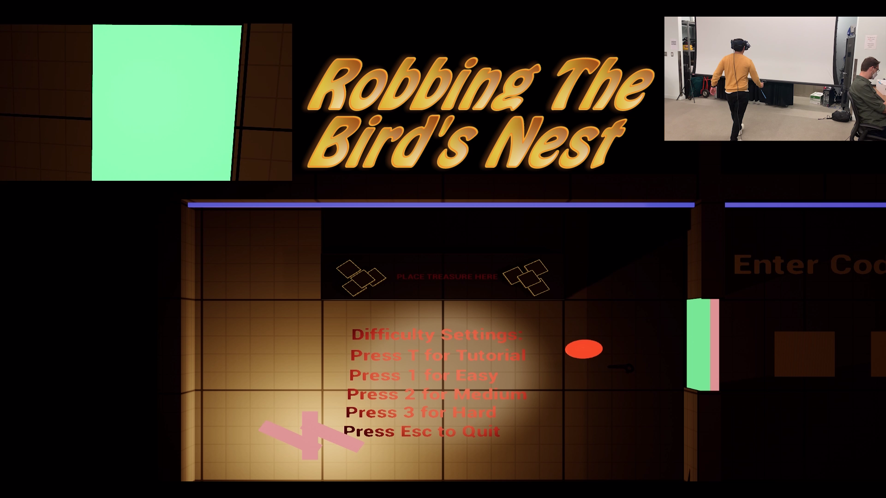
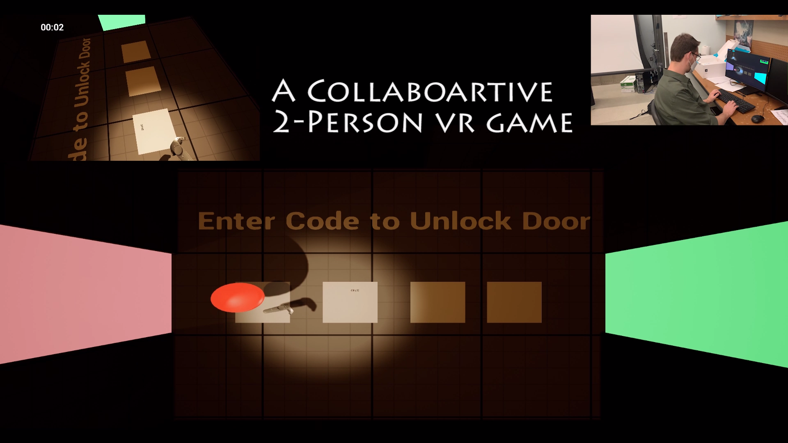
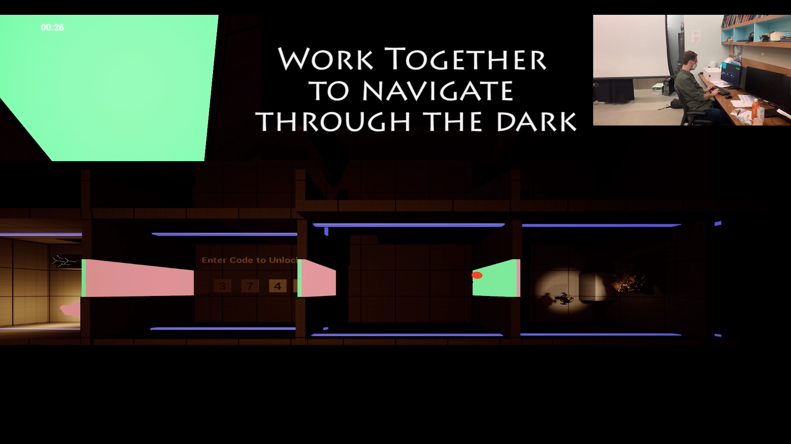

# Robbing The Bird's Nest
## A 2 Player Cooperative VR Game

******

**Created by Nathan Devlin, Anthony Mansur, and Jacky Lu**

## [Click here for Game Trailer](https://drive.google.com/file/d/1Sk0GgzvECwEfDHEiNujv9DLqNhKkF-nd/view) 

## Overview
Did you ever see yourself in Mission Impossible or Ocean’s 11, working as a team to break into a vault to nab the valuables before you get caught? Now you’ll have the opportunity to see if you have what it takes! One player will strap on the VR headset and infiltrate the vault to steal the treasure, the other will observe from above, helping them navigate through the vault, solve puzzles, and avoid being detected. 

Players must interact in real time and work together to get in and get out safely. The player with the VR Headset, the "Worm", will move through the space, avoid obstacles, look for clues, and avoid being seen. The player at the computer, the "Bird," can see the whole scene from above, modify the lighting in real time to help the Worm, and manipulate the environment in other ways. The Worm will see these changes live and can interact with the virtual world accordingly.

This game was implemented using Unreal Engine, Steam VR, and the HTC Vive Pro. Blueprints were used extensively to handle the game logic, input from the computer and the VR headset, and more.

******

******

## Game Documentation
### User Guide
#### Basic Operational and Constitutive Rules
* Both players collaborate with each other with the objective of the "Worm" retrieiving a treasure from the target room. The Worm must go to the target room, pick up the treasure, and place it back in the lobby's table, without being detected by the robots. The players win the game the moment the Worm places the treasure on the table inside the lobby. 
* The Worm has limited visibility (degree of visibility depends on the level of difficulty) in the darkness when it’s not lit by the light operated by the Bird. The Worm will be sent back to the lobby if he or she is detected by the robots and will have to restart from the lobby.
*  In addition to operating the light to help the Worm navigate in between rooms and avoid being detected by the robots, the Bird is also responsible for moving the light such that the Worm can find the code required for entering certain rooms in virtual reality. 
  * For example, the Worm will have to find the 4 digits code with the help of the Bird, and the Worm will have to communicate with the Bird verbally so that the Bird can enter the code using the keyboard and open the door for the Worm in virtual reality. 
* The Bird overlooks the game map from above and can go in between zoom-in and zoom-out mode.
#### Player Controls and Inputs
* Worm
    * Vive Virtual Reality Headset: for visual and aural immersion in the virtual reality space
    * Trigger Button on Right Vive Virtual Reality Controller:
        1. for opening the door when the player is near the door
        2. for picking up the treasure when the player is near the treasure, and for putting down the treasure
* Bird
	* Key T: for selecting “Tutorial Mode” as the game’s difficulty level
	* Key 1: for selecting “Easy Mode” as the game’s difficulty level
	* Key 2: for selecting “Medium Mode” as the game’s difficulty level
	* Key 3: for selecting “Hard Mode” as the game’s difficulty level
	* Arrow Keys (Up, Down, Left, Right): for moving the light in the scene
    * Keys 0-9: for inputting the 4 digits secret code in order to open the door to the next room for the Worm in virtual reality space
    * Key Shift: for switching between the zoom-out mode where the map of all rooms show up on the screen and the zoom-in mode where only the room that the Worm is currently in is showed on the screen
	  Key Esc: exiting the game

#### Difficulty Levels Information
* Tutorial Mode
	* Player can not be detected in this mode; Player may walk through to see game layout and understand their tasks and obstacles
* Easy Mode
	* Light Intensity/Darkness Level: Some ambient light
	* Robot Field of View Angle: N/A
	* Robot Speed: Slow
* Medium Mode
	* Light Intensity/Darkness Level: Very little ambient light
	* Robot Field of View Angle: N/A
	* Robot Speed: Fast
* Hard Mode
	* Light Intensity/Darkness Level: No ambient light
	* Robot Field of View Angle: N/A
	* Robot Speed: Very fast
			

### **Setup and Configuration**
* Step 1: Connect the Vive virtual reality headset to the machine that the game will run on.
* Step 2: Use SteamVR to setup the virtual reality environment’s boundary and have a one-to-one mapping between the physical space and room scale virtual reality space
* Step 3: Run the game executable file.
* Step 4: Select difficulty level by pressing the T key, the 1 key, the 2 key, or the 3 key
* Step 5: Game starts!
### **Major Gameplay Features**

"*" Indicates features added during Beta 

* Flip-Flop player teleportation mechanism to map multi-room virtual reality space to one-room physical space
* Random 4 digits code generation and spawning at random location
* Code entering and displaying
* Procedurally determined robot patrolling path
* VR spectator camera with zoom-out mode where the map of all rooms show up on the screen and zoom-in mode where only the room that the Worm is currently in is showed on the screen
* Orange “hat” with emissive material (in order to stand out in darkness) that marks the Worm’s location in the map
* Game logic with win/loss condition + game state
* Timer*
* Sounds*
  * Robot patrolling, played at robot location
  * Treasure pickup
  * Treasure placement
  * Robot detection alarm
  * Door opening

* Adjustable Game Difficulty Levels*
* Visual indicator (cone) with angle that matches the robot's detection field of view*
* Colored doors to provide better indication of direction*
* Smooth robot rotation at corners in patrolling path*
* Improved game logic + refactoring*

### **Technical Issues encountered using Vive & Unreal Engine**

The biggest challenge with using Vive was getting the base stations connected and synchronized. Several times, the game would gray out when player goes near the edge of the game arena. 

No significant technical issues was experienced with Unreal Engine.

### **Third Party Plugins and Assets**

* Robot Asset: https://www.cgtrader.com/free-3d-models/character/sci-fi/spider-robot-cc31ad14-882f-4e67-88e3-22713e73855d
* Treasure Asset: https://www.cgtrader.com/free-3d-print-models/jewelry/pendants/dragon-free

## Design Document

### Executive Summary

#### High Concept

Did you ever see yourself in Mission Impossible or Ocean’s 11, working as a team to break into a vault to nab the valuables before you get caught? Now you’ll have the opportunity to see if you have what it takes!
Theme: Cooperation involving both Bird’s Eye and Worm’s Eye views

#### Main Features

Two players cooperate to reach the vault and get back out again before they are caught!

One Player is the Worm, codename for the man on the ground, navigating the facility and avoiding danger while trying their hardest to wriggle their way into the vault.
The other player is the Bird, codename for the hacker, able to see everything from above, and helping the Worm navigate the labyrinthine facility, avoid obstacles, and evade detection.

Both players work on the same game instance, one using the VR headset, the other on the computer.

The facility is a maze of small rooms wherein certain rooms connect to one another and the Worm needs the Bird’s help to know which way to go to get to the vault.
The facility is patrolled by robots on preset paths that are looking for intruders: the Bird and the Worm must work together to avoid detection. Where the Surveillance Robots can see and thus detect the Worm will be represented visually (Perhaps a visible Laser) so that the player will know where they need to avoid being to avoid being detected.

The Bird can control a light that they can move around the facility: The robots can only see the Worm when they are under this light, but the Worm needs this light as well to be able to see where they are going
There will be some obstacles in the room that the Bird can move out of the way for the Worm.

Once the player successfully navigates through one room, they enter the next room. This will allow us to re-map the space so that the player can then move along the same real-world floor space.

### Appeal

#### Player Motivation

For the Worm, their challenge is to stay agile enough to stay in the right place at the right time and not get caught by the robots. For the Bird, their challenge is to help the Worm avoid danger and navigate the space effectively. For both players, they will be challenged to communicate effectively, and put together the data that they each have from their own unique perspective.

#### Target Audience

Our target audience will be gamers with VR headsets of any age older than 12

### Creative Design

#### Design Goals

**Different Perspectives:** Each player will have a unique perspective on the game, giving us a natural and built-in challenge: each player must align their own perspective with their partner to reach a common goal. Additionally, these different perspectives will give our game replay value because each perspective will have a completely different challenge and players will be able to switch off and play both positions.

**Different Skillsets:** Different skillsets will be put to the test in this game. The Worm will need to be agile, quickly and carefully navigating the space to avoid the robots, but also being patient and perceptive to know when is the right time to move. The Bird will need to think critically to figure out which is the right way to navigate the maze, and will need to be a good communicator to help the Worm avoid danger.

**Simultaneously Familiar and Novel:** Fans of Escape Rooms will feel at home with the feel of the game, since they need to navigate one room at a time to get to the Vault. However, unlike an Escape Room, the two players each have very different perspectives and will have to use those differing perspectives to their advantage if they are to avoid detection.

### Concept/Features 

#### Player Goals and Objectives

Reach the vault and steal the target before getting caught. We can play test to see if the player should also have to navigate back out without getting caught.

#### Main Game Mechanic

For the player in the VR headset, their main mechanic will be physically moving in the space to navigate through each room and avoid being seen by the surveillance robots.

For the player on the computer, their mechanic will be pointing and clicking/ dragging, and possibly some keyboard controls to move obstacles in the way of the Worm, and move the main light

#### Player Resources

The Bird’s main light will be a resource for the first player. I also had a thought that maybe the Worm could have a Taser that they could only use a few times to disable a surveillance robot, which would be another resource. The Worm can also use temporary invisible cloak for a set amount of time in order to avoid being detected by the robots. The cloaks can be resources that can be collected on the map or resources that are given to the player at the beginning of the game.

#### Boundaries and Constraints

The most obvious constraint will be the virtual walls in the VR world. Since the Vive can only move in an approximately 15X15 space, the virtual rooms in the game will have to be smaller than the physical space in the real world.

#### Immersive and Interactive Qualities

The Worm will be physically moving in the real world as they move through the virtual space. This will be highly immersive and interactive.

#### Look and Feel

**Genre:** This game brings together the fun of an Escape Room with the challenge of two teammates having wildly different perspectives trying to solve the same problem, all in the immersive, otherworldly environment of VR.

**Uniqueness:** I personally have never played a game like this, so I believe it is a fairly unique concept. Also the fact that it is collaborative, where two players work together with significantly different mechanics I think is quite unique and also gives the game a lot of replay value since players can switch their role and have a new experience.

### Backstory, Characters, and Worlds

#### Premise

**Mission Debrief for agent Worm:**
You are a special operations agent, code name Worm, and your mission is to extract a top secret item in a heavily guarded building. You will work with another special operations agent code name Bird, who will give you both verbal directions and operate a light to guide your path to the destination where the secret item is located. Inside the vaults, you need to avoid the patrolling robots at all cost because their laser knives will cut you into pieces once they spot you. Fortunately, as long as you are not lit by the light, the robots cannot detect you. As a result, you will have to coordinate with the Bird closely in order to have enough clarity on your way to the target location but not get exposed to the robots.

**Mission Debrief for agent Bird:**
You are a special operations agent, code name Bird, and your mission is to help another special operations agent, code name Worm, to extract a top secret item in a heavily guarded building. You will not enter the building yourself; instead, you will provide verbal information to agent Worm and operate a light to help him navigate in darkness based on the high level overview information provided to you. However, please be careful since agent Worm’s life entirely depends on you since he will be cut into pieces by the patrolling robots’ laser knives if he’s detected by the robots. Fortunately, as long as agent Worm is not lit by the light, he will not be spotted by the robots. As a result, your goal is to work closely with agent Worm and guide him/her in combination with the valuable information you have from the high level overview of the building

**Spaces/Worlds (includes concept art, sketches, etc.)**
The spaces will be a series of small rooms that the player moves through to get to the center of the maze, where the target is located. Each room will have multiple doors, such that the Worm will need the help of the Bird to know which way they should go to get to the Vault, the main room with the target they are trying to steal. These rooms will have some physical obstacles, and surveillance robots that move on fixed paths, scanning the area for intruders. The rooms will be fairly dark, lit primarily by the main light that the Bird controls. This will both add further challenge to the game, and also decrease the amount of production design we will need to make our game look professional. 

We may have something like 25 total rooms, some of which are connected, some of which are not, in a maze-like pattern. The Worm will need the help of the Bird to be able to know which doors to use to get where they want to go.

**Main Bosses, sub-bosses (includes concept art, sketches, etc.)**
We could potentially have some kind of difficult final Surveillance Robot, such as robots that can move around and detect any intruders in an extremely fast and agile manner, in or right before the final vault that the player will have to get past to get the target.

### Interaction Models

#### User Interface

For the Worm, their main User interface will consist of moving physically in the space, thus controlling where their virtual avatar is in the virtual world. They could also use the hand controllers to open doors, move objects, or solve small challenges/ puzzles we could require for them to get to the next room. If we do the Taser idea, then they could also use the hand controller to aim and shoot the Taser to take out the surveillance robots

**User/Environment - Obstacles and Props**
The main obstacle will be the surveillance robots. However, there may also be physical barriers that the player or the Bird will have to move out of the way. There will be doors in the rooms that the Worm will have to open to get to the next room.

**Multi-Player**
There will be 2 players: One player will be using the VR headset and the other player will be on the computer

**Networked Play**
There will not be networking involved in the game

### Rules and Procedures

#### Operational and Constitutive Rules

The players’ goal is to collaborate with each other in order for the Worm to reach the target location where the top secret item is located.
The Worm cannot see anything if it’s not lit by the light operated by the Bird.
The Worm will be killed by the patrolling robots if he/she is detected by the robots. Note that robots can only detect the Worm when the Worm is lit by the light.
The Bird has access to a high level overview/map of the building as well as the current location of the Worm inside the building.

#### Game Play Sequence

The player will enter the first room to begin the game. They will have to move through the room without being seen by the surveillance robots and get to the correct door, which the Bird will help them to find. They will move through a series of rooms until they get to the Vault, the final room. They need to get the Target from this room, and then get back out to the original entrance.

#### Levels of Difficulty

Different rooms/vaults inside the building will have different levels of security patrols by the robots and thus creating different levels of difficulty for the players.
We could also add a timer to make the game more difficult if necessary.

#### Performance and Scoring

**State Variables**
What you need to save in order to restore the game
The player’s location is the main state variable. However, this is intended to be a relatively short game, so it is unlikely that we will create a mechanism to save and reload the game.

Metrics - 
The game will be winner take all: Either the players successfully steal the Target and get out safely, or they get caught and lose the game.

### Implementation Details

#### Design Assumptions

Hardware
UE4 spec requirements.
Desktop PC
Windows 7 64-bit
Quad-core Intel or AMD processor, 2.5 GHz or faster.
NVIDIA GeForce 470 GTX or AMD Radeon 6870 HD series card or higher.
8 GB RAM.

#### Software

​            We will be using the Unreal Engine 4 software. 

#### Level design and layout

The layout will be composed of smaller approximately 10ft X 10ft rooms that connect to each other via doors. The Bird will be able to see where the Vault is and where the player is to help them navigate to the right place, but the player will not know which doors they should use without the Bird’s help.

Examples of typical puzzle and game play sequences:
Example 1: The Worm enters the first room, avoids the surveillance robot, goes to Door #2 as indicated by the Bird, and enters the second room. A surveillance robot sees them, and they lose the game.
Example 2: The player successfully navigates each room and gets to the Vault. They pick up the target and begin navigating back out of the maze. (Perhaps we could make them move slower due to the target object being heavy, making it harder in the second part of the game). They successfully navigate out to their starting point, exit the maze, and win the game.

#### Technology and Algorithms

Blueprints

#### Design Logic

Finite state machine - Play state/effect

#### UI Management

**In-game**
The Bird will be able to see an overhead view of the Level, and where the Worm is in that level, along with where the surveillance robots are, etc.
The Worm will have a 3D first-person view of the room they are in. If we have a timer, the amount of time they have remaining will be visible to them. If we use the Taser idea, the number of shots remaining in their Taser will be shown as well
**Start Menu**
The Start Menu will be a simple, standard, straight-forward Start Menu; there are no options the user needs to change or worry about
**Game Solution/Action**
The solution of the game is successfully navigating to the center Vault, picking up the Target, and navigating back out without being detected.
